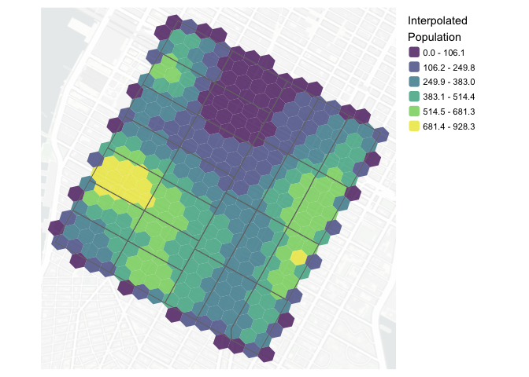

<!-- README.md is generated from README.Rmd. Please edit that file -->

# pycnogrid

<!-- badges: start -->

<!-- badges: end -->

`pycnogrid` provides tools for pycnophylactic interpolation of polygon
totals to H3 grids while preserving mass.

## Installation

You can install the development version of `pycnogrid` from GitHub:

``` r
# install.packages("remotes")
remotes::install_github("higgicd/pycnogrid")
```

## Example

``` r
library(dplyr)
library(pycnogrid)
library(sf)
library(tmap)
```

``` r
out <- nyc_ct_small |>
  pycnogrid::to_grid(
    value_col = "populationE",
    grid_type = "h3",
    resolution = 10
  )
```

The returned object:

``` r
out |> glimpse()
#> Rows: 336
#> Columns: 7
#> $ h3                <chr> "8a2a100d2db7fff", "8a2a100d2d97fff", "8a2a100d2d87f…
#> $ geometry          <POLYGON [m]> POLYGON ((585062.6 4511955,..., POLYGON ((58…
#> $ .tid              <int> 1, 2, 3, 4, 5, 6, 7, 8, 9, 10, 11, 12, 13, 14, 15, 1…
#> $ pycno_populationE <dbl> 103.085325, 183.514968, 32.247510, 11.821690, 41.908…
#> $ pycno_density     <dbl> 0.0068098960, 0.0121233098, 0.0021303414, 0.00078095…
#> $ pycno_coverage    <dbl> 1.0000000, 1.0000000, 1.0000000, 1.0000000, 1.000000…
#> $ pycno_iter        <int> 27, 27, 27, 27, 27, 27, 27, 27, 27, 27, 27, 27, 27, …
```

The results of this interpolation are shown in @fig-pycno_nyc_ct_small:

<figure>

<figcaption aria-hidden="true">Census tract population counts
interpolated to an H3 grid</figcaption>
</figure>
