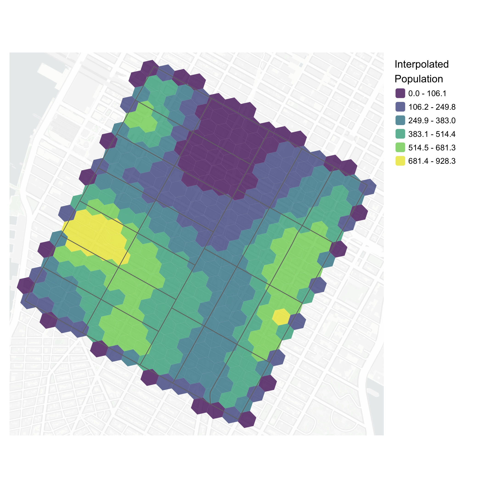

<!-- README.md is generated from README.Rmd. Please edit that file -->

# pycnogrid

<!-- badges: start -->

[](https://CRAN.R-project.org/package=pycnogrid)
[](https://cran.r-project.org/package=pycnogrid)
[](https://github.com/higgicd/pycnogrid/actions/workflows/R-CMD-check.yaml)
<!-- badges: end -->

`{pycnogrid}` provides tools for interpolating more aggregate
polygon-level extensive data (e.g. population, employment, or event
counts) to a range of alternative grid types using pycnophylactic
interpolation.

Often administrative and statistical reporting units do not align with
the geographic supports needed for analysis. They can also introduce
sensitivity to the scale and zoning of spatial units, which are central
to the modifiable areal unit problem (MAUP). Waldo Tobler’s
pycnophylactic interpolation method can potentially help to address this
mismatch by transferring polygon totals to an alternative regular grid
while preserving represented source totals and smoothing estimates
across neighbouring cells.

Existing implementations of Tobler’s pycnophylactic interpolation
include the `{pycno}`
[package](https://doi.org/10.32614/CRAN.package.pycno) for R and the
`{tobler}` [module](https://doi.org/10.5281/ZENODO.3386576) within the
larger Python Spatial Analysis Library (PySAL). These implementations
focus on transferring source data to target raster cells. {pycnogrid}
extends Tobler’s pycnophylactic interpolation approach beyond regular
raster lattices and supports a range of discrete global grid systems
(DGGSs), including H3, A5, S2, and ISEA grids, as well as rasters and
other local grids. The flexibility of the underlying interpolation
approach makes it possible to create spatially smooth, mass-preserving
representations of aggregate data with area or shape preserving
geographic supports.

For a full introduction to the interpolation workflow, grid options, and
output interpretation, see the [getting started
vignette](https://higgicd.github.io/pycnogrid/articles/getting_started.html).

## Installation

You can install `{pycnogrid}` from CRAN or GitHub:

``` r
# from CRAN
install.packages("pycnogrid")

# install.packages("remotes")
remotes::install_github("higgicd/pycnogrid")
```

## Example

This example interpolates census tract population counts for a small
area of New York City to an H3 grid at resolution 10:

``` r
library(dplyr)
library(pycnogrid)
library(sf)
library(tmap)
```

``` r
out <- nyc_ct_small |>
  pycnogrid::to_grid(
    value_col = populationE,
    grid_type = "h3",
    resolution = 10
  )
```

The returned object is an {sf} object containing the target-cell
geometries, the interpolated count, an estimated density, and the
proportion of each cell covered by the source geography. The map below
shows the interpolated population counts:

<div class="figure">


<p class="caption">

Census tract population counts interpolated to an H3 grid.
</p>

</div>

## How it works

For a polygon layer containing source totals, `{pycnogrid}`:

1.  creates a target grid covering the source geography;
2.  allocates each source total to intersecting target cells;
3.  smooths estimated densities across neighbouring cells; and
4.  repeatedly rescales the estimates so that represented source zone
    totals are preserved under centroid-based cell assignment.

The resulting grid can be used in downstream mapping, accessibility,
spatial modelling, and sensitivity analyses.

### Key arguments

The main function, `to_grid()`, provides several options for specifying
the target geography and interpolation process:

- `source` is the source {sf} polygon layer containing the totals to be
  interpolated. Given the geometry calculations performed by the tool,
  only inputs with projected coordinate reference systems are accepted.
- `value_col` is the column in `source` containing the count variable to
  be smoothed and preserved
- `id_col` is an optional column uniquely identifying each source
  polygon, if omitted, an internal identifier is created
- `grid_type` specifies the target grid system. Supported options are
  H3, A5, S2, ISEA grids with aperture-3 and 4, and raster-derived
  polygon cells
- `resolution` controls the size of the target grid cells. Its
  interpretation depends on the selected grid type
- `cell_inclusion` defines how candidate grid cells are selected for
  interpolation. With “intersect”, cells are included if they intersect
  a source polygon. With “centroid”, cells are included only when their
  centroid falls inside a source polygon.
- `cell_allocation` defines how source totals are allocated.
  `"centroid"` is the default and assigns each cell to one source
  polygon, preserving represented source-zone totals. `"area"` uses
  fractional overlap areas and is experimental; it preserves the overall
  represented total but may not preserve each individual source-zone
  total.
- `nb_order` specifies the neighbourhood order used during smoothing. A
  value of 1 uses immediately adjacent cells, while larger values extend
  the smoothing neighbourhood outwards from a given cell.
- `max_iter` sets the maximum number of smoothing iterations. If set to
  0, the function returns the initial allocation without iterative
  smoothing.
- `tolerance` defines the convergence threshold. Iteration stops when
  the relative change in estimated cell densities falls below this
  value.
- `include_self` controls whether each cell includes its own current
  value when calculating the neighbourhood mean during smoothing.
- `missing_policy` determines how the function handles source polygons
  that receive no target grid cells, which might arise due to a mismatch
  in source polygon sizes and target grid cell resolutions. “abort”
  stops with an error, “warn” returns a warning, and “ignore” proceeds
  silently.

For analyses requiring strict source-zone preservation, use
`cell_allocation = "centroid"`. Fractional area allocation may provide
more complete boundary representation, but it is experimental in version
0.2.1.

### Interpreting the output

Interpolated values are estimates of the amount of the source total
associated with each target cell. With `cell_allocation = "area"`, the
output for partially covered target cells represents the amount
estimated within the portion of the cell that overlaps the source
geography. In this sense, the method does not extrapolate counts beyond
source boundaries. The output includes:

``` r
out |> glimpse()
#> Rows: 336
#> Columns: 7
#> $ h3                <chr> "8a2a100d2db7fff", "8a2a100d2d97fff", "8a2a100d2d87f…
#> $ geometry          <POLYGON [m]> POLYGON ((585062.6 4511955,..., POLYGON ((58…
#> $ .tid              <int> 1, 2, 3, 4, 5, 6, 7, 8, 9, 10, 11, 12, 13, 14, 15, 1…
#> $ pycno_populationE <dbl> 231.557990, 302.494228, 44.673391, 17.728479, 49.194…
#> $ pycno_density     <dbl> 1.529690e-02, 1.998328e-02, 2.951222e-03, 1.171166e-…
#> $ pycno_coverage    <dbl> 1, 1, 1, 1, 1, 1, 1, 1, 1, 1, 1, 1, 1, 1, 1, 1, 1, 1…
#> $ pycno_iter        <int> 31, 31, 31, 31, 31, 31, 31, 31, 31, 31, 31, 31, 31, …
```

with:

- `pycno_<value_col>`: the interpolated extensive value for each target
  cell
- `pycno_density`: the estimated density used during the smoothing
  process
- `pycno_coverage`: the proportion of the target-cell area covered by
  the source geography
- `pycno_iter`: the number of smoothing iterations used

Additional information about convergence, represented input totals,
missing source areas, grid settings, and neighbourhood settings is
stored as attributes on the returned object.

## Important considerations

The pycnophylactic interpolation algorithm implemented in `{pycnogrid}`
is intended for extensive variables: quantities that can be meaningfully
divided and summed across space, such as population, households, jobs,
trips, or service counts.

It should not be used to directly interpolate intensive variables such
as median income, percentages, rates, or averages. Where appropriate,
interpolate the underlying numerator and denominator separately, then
calculate the rate or ratio on the resulting grid.

Grid choice remains an analytical decision. Different grids vary in cell
area, shape, orientation, hierarchy, adjacency structure, and
suitability for tasks such as spatial aggregation, indexing,
visualization, or accessibility analysis. Moreover, options related to
cell inclusion, allocation, neighbourhood order, etc., can all
meaningfully shape the nature of the interpolation and smoothing.
`{pycnogrid}` facilitates comparison across these alternative spatial
support systems and modelling choices rather than treating any single
grid as universally optimal.
