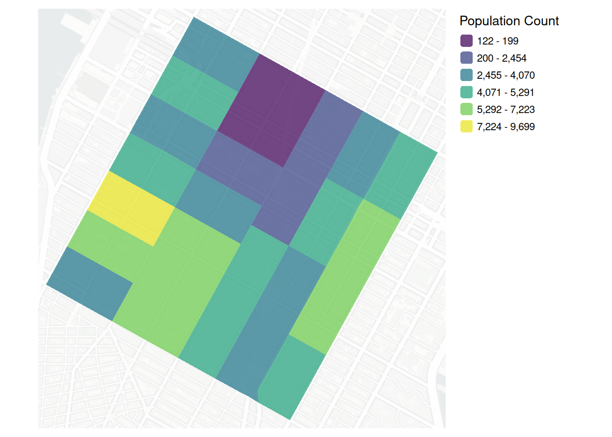
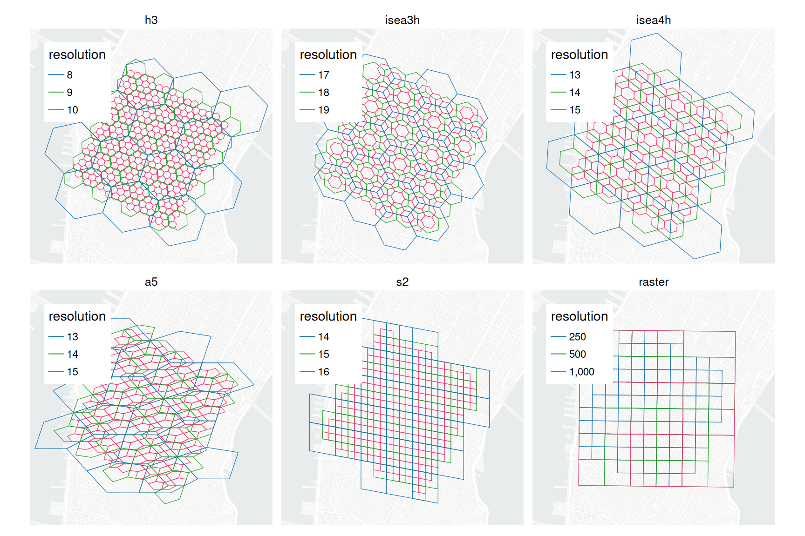
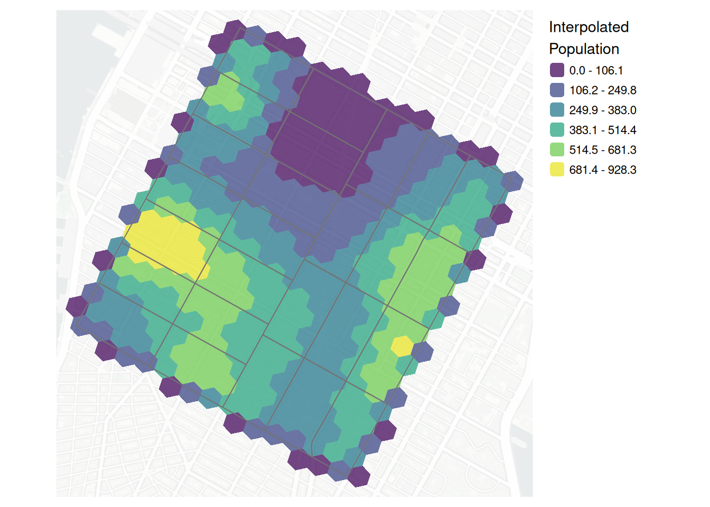
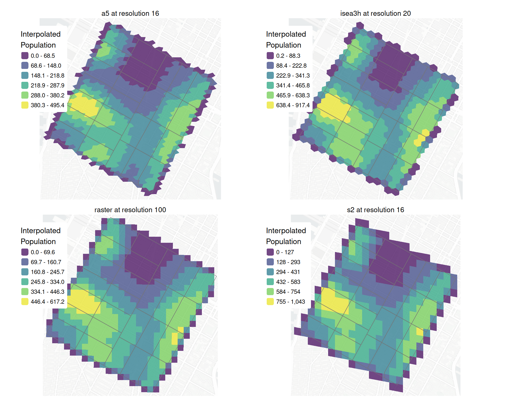
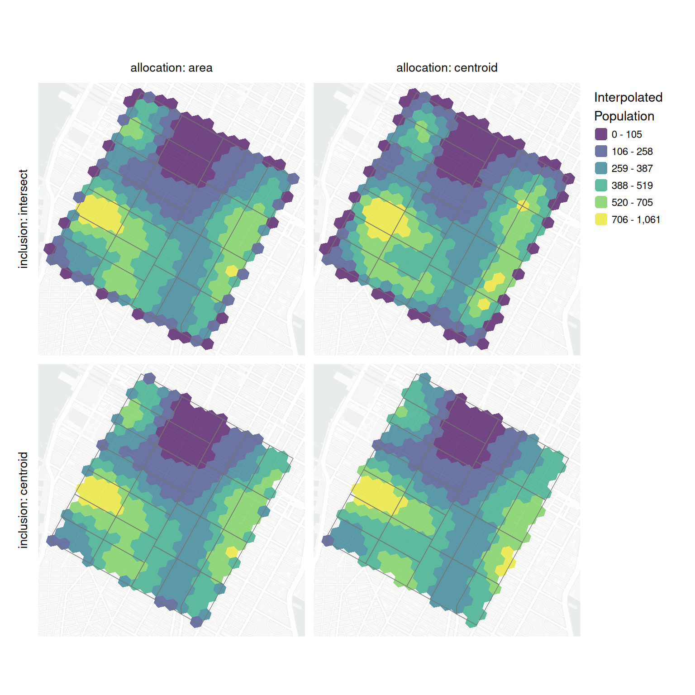
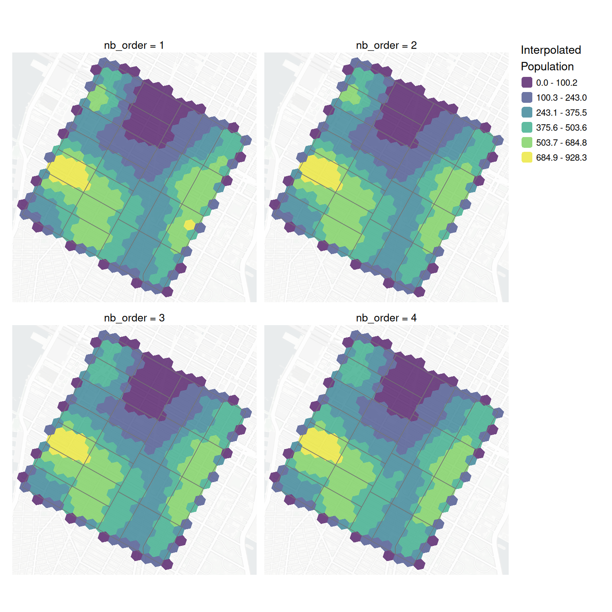
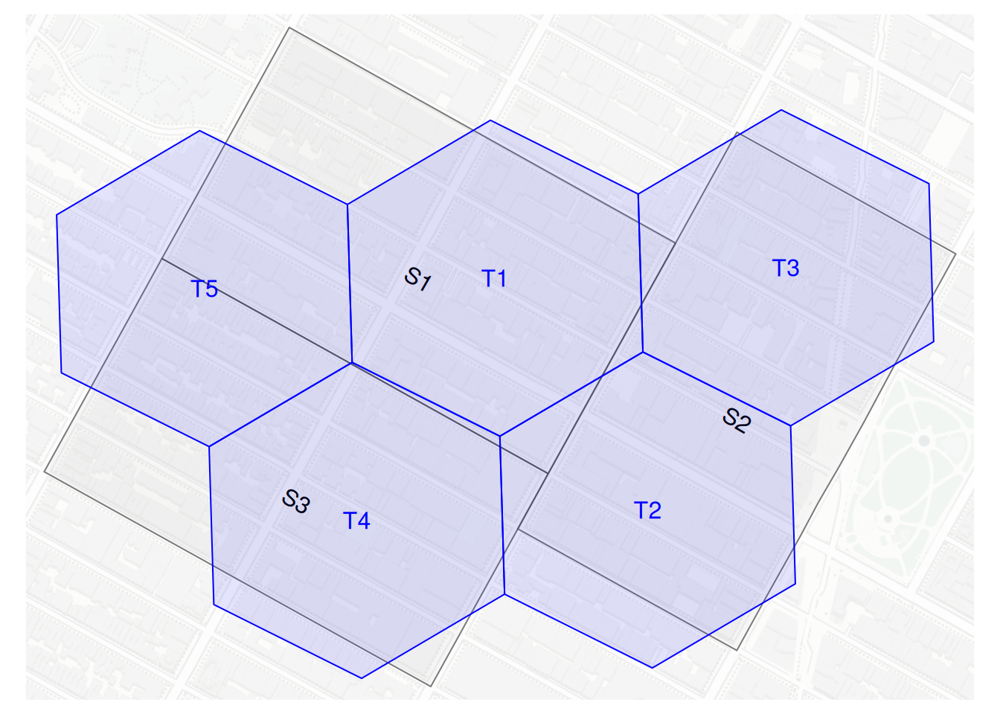
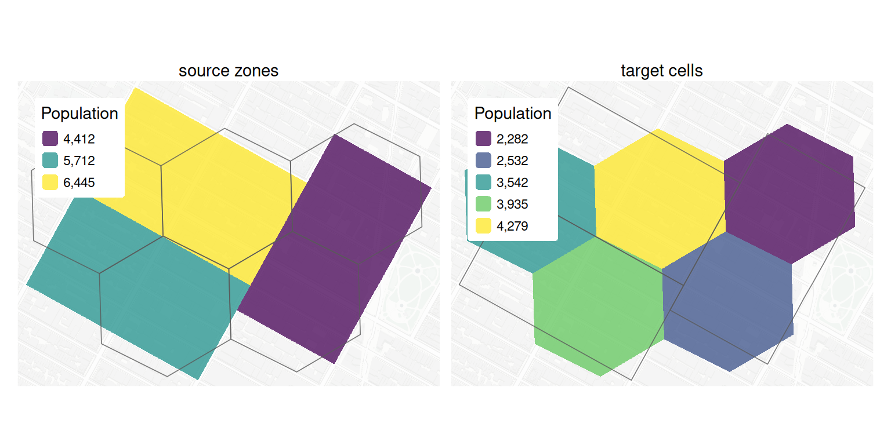

# `{pycnogrid}`: Flexible pycnophylactic interpolation to disgrete global and raster grid systems

## Introduction

Spatial data capturing the socioeconomic, demographic, environmental,
health, travel, and other characteristics of different places has become
increasingly abundant. However, much of these data are released in a
spatially aggregated form, represented through administrative and
statistical reporting units such as census tracts, postal codes, or
traffic analysis zones. While these spatial units facilitate data
collection, privacy protection, and dissemination, they may not align
with the geographic frame associated with particular research questions
or analyses. This mismatch lies at the heart of the modifiable areal
unit problem (MAUP) ([Openshaw 1979](#ref-openshaw1979)), which
recognizes that observed spatial patterns and statistical relationships
may vary according to the zoning system used to aggregate data.
Researchers and practitioners therefore frequently face the challenge of
transferring information from source zones to alternative target
geographies, creating a longstanding need for areal interpolation
methods. At the same time, the growing use of regular grids and discrete
global grid systems (DGGSs) for spatial analysis has increased the
demand for methods capable of redistributing aggregated data to
alternative spatial tessellations while preserving known source-zone
totals.

Among areal interpolation methods for extensive data, Tobler’s
pycnophylactic interpolation ([Tobler 1979](#ref-tobler1979)) is
distinguished by its emphasis on mass or volume preservation and spatial
smoothing. Rather than assuming constant distributions of the source
zone values across the target cells, pycnophylactic interpolation
iteratively smooths the estimated target values while enforcing the
preservation of the source zone totals in the system. With sufficiently
fine target geometries, the result is a continuous spatial surface that
preserves known aggregate quantities while reducing the abrupt
discontinuities across zones introduced by administrative boundaries. In
doing so, the method acknowledges that spatial aggregation obscures
local variation and seeks to recover a *plausible* representation at a
finer alternative level of geography. The resulting surface embodies the
intuition that nearby locations are expected to exhibit greater
similarity than more distant locations ([Tobler 1970](#ref-tobler1970);
[Tobler 2004](#ref-tobler2004)).

Several implementations of Tobler’s pycnophylactic interpolation exist
for popular computing languages, including `{pycno}` ([Brunsdon
2025](#ref-pycno2025)) for R and within the `{tobler}` package ([Eli
Knaap et al. 2026](#ref-eliknaap2026)) for Python, which is part of the
larger Python Spatial Analysis Library (PySAL) ([Sergio Rey et al.
2026](#ref-sergiorey2026)). These existing implementations have largely
followed Tobler’s initial formulation of pycnophylactic interpolation
from source zones to target raster cells. For example, the `pycno()`
function from the `{pycno}` package converts source polygons to a
regular grid and initializes a density surface by assigning a uniform
density to all grid cells within each source zone. The density surface
is then iteratively smoothed across neighbouring grid cells while
correction steps ensure that the integrated target values within each
source polygon remain equal to their original observed total. Built on
the legacy [sp](https://github.com/edzer/sp/) framework, the package
requires `SpatialPolygonsDataFrame` inputs and outputs a
`SpatialGridDataFrame`. The PySAL `tobler` implementation follows a
similar raster-based philosophy but performs smoothing through
convolution-based operations on an array, with repeated correction steps
used to preserve source-zone totals in the target cells.

Building on these foundations, the primary contribution of
[pycnogrid](https://higgicd.github.io/pycnogrid/) is not a new
pycnophylactic algorithm for users of the R computing language, but
rather a more flexible implementation that extends pycnophylactic
interpolation beyond regular raster lattices to a range of DGGS spatial
grids. Capitalizing on the contemporary simple features library
([sf](https://r-spatial.github.io/sf/) ([Pebesma
2018](#ref-pebesma2018))) and the neighbour relationships and spatial
weights matrices that underpin much of modern spatial analysis and
econometrics ([Anselin 1988](#ref-anselin1988)) (through the
[spdep](https://github.com/r-spatial/spdep/) ([Bivand
2022](#ref-bivand2022)) and [sfdep](https://sfdep.josiahparry.com)
([Parry and Locke 2024](#ref-sfdep2024)) packages),
[pycnogrid](https://higgicd.github.io/pycnogrid/) implements
pycnophylactic interpolation as a generalized neighbourhood-based
smoothing problem. Rather than restricting smoothing to a regular raster
lattice, values are smoothed using the neighbourhood structure defined
by the underlying grid, allowing the method to be applied consistently
across grid systems including H3, A5, S2, and various ISEA apertures, as
well as traditional raster grids. This flexibility enables users to
select a grid system whose geometric properties are better aligned with
the requirements of subsequent analyses.

## Example Workflow

The primary function in {pycnogrid} is
[`to_grid()`](https://higgicd.github.io/pycnogrid/reference/to_grid.md),
which takes the following parameters:

```` markdown
```{r}
#| label: to_grid
#| echo: true
pcynogrid::to_grid(
  source,
  value_col,
  id_col = NULL,
  grid_type = c("h3", "a5", "s2", "isea3h", "isea4h", "isea7h", "raster"),
  resolution,
  cell_inclusion = c("intersect", "centroid"),
  cell_allocation = c("area", "centroid"),
  nb_order = 1,
  max_iter = 500,
  tolerance = 1e-4,
  include_self = TRUE,
  missing_policy = c("abort", "warn", "ignore")
) 
```
````

where

- `source` is the source {sf} polygon layer containing the totals to be
  interpolated. Given the geometry calculations performed by the tool,
  only inputs with projected coordinate reference systems are accepted.
- `value_col` is the column in `source` containing the count variable to
  be smoothed and preserved
- `id_col` is an optional column uniquely identifying each source
  polygon, if omitted, an internal identifier is created
- `grid_type` specifies the target grid system. Supported options are
  H3, A5, S2, ISEA grids with aperture-3, 4, and 7, and raster-derived
  polygon cells
- `resolution` controls the size of the target grid cells. Its
  interpretation depends on the selected grid type
- `cell_inclusion` defines how candidate grid cells are selected for
  interpolation. With “intersect”, cells are included if they intersect
  a source polygon. With “centroid”, cells are included only when their
  centroid falls inside a source polygon.
- `cell_allocation` defines how source totals are allocated to grid
  cells. With “area”, values are allocated in proportion to the area of
  overlap between source polygons and grid cells. With “centroid”, each
  grid cell is assigned to the source polygon containing its centroid.
- `nb_order` specifies the neighbourhood order used during smoothing. A
  value of 1 uses immediately adjacent cells, while larger values extend
  the smoothing neighbourhood outwards from a given cell.
- `max_iter` sets the maximum number of smoothing iterations. If set to
  0, the function returns the initial allocation without iterative
  smoothing.
- `tolerance` defines the convergence threshold. Iteration stops when
  the relative change in estimated cell densities falls below this
  value.
- `include_self` controls whether each cell includes its own current
  value when calculating the neighbourhood mean during smoothing.
- `missing_policy` determines how the function handles source polygons
  that receive no target grid cells, which might arise due to a mismatch
  in source polygon sizes and target grid cell resolutions. “abort”
  stops with an error, “warn” returns a warning, and “ignore” proceeds
  silently.

Together, these parameters define three main stages of the workflow:
construction of the target grid, allocation of source totals to grid
cells, and iterative pycnophylactic smoothing. The grid parameters
determine the spatial support of the output surface, the allocation
parameters determine the initial mass-preserving estimate, and the
smoothing parameters control how values are redistributed across
neighbouring cells while preserving the original source-zone totals.
Additional functions, such as
[`to_h3()`](https://higgicd.github.io/pycnogrid/reference/to_h3.md) and
[`to_a5()`](https://higgicd.github.io/pycnogrid/reference/to_a5.md), are
grid-specific wrappers around
[`to_grid()`](https://higgicd.github.io/pycnogrid/reference/to_grid.md).
The properties of the different grid systems are discussed further
below.

### Source Zone Data

The first part of a pycnophylactic workflow is to obtain more aggregate
source data to be smoothed to a finer-resolution target grid.
Pycnophylactic interpolation is designed for non-negative extensive
variables – quantities such as counts that can meaningfully be divided
among smaller areas and whose total should be preserved. For an example
case, 2020 population data was obtained for census tracts in New York
City using the {tidycensus} ([Walker and Herman
2026](#ref-tidycensus2026)) package. A sub-sample of this data covering
an area of Lower Manhattan is included in the package as `nyc_ct_small`
([Figure 1](#fig-sample_population_count)). The census tracts in this
area contain a total of 113,359 people.



Figure 1: Sample population count data for Lower Manhattan

### Target Grid Systems

The choice of a target grid system is not merely a computational
consideration as different grid systems prioritize different geometric
and analytical properties, including equal-area representation, shape
preservation, neighbourhood structure, hierarchical indexing, and
scalable spatial computation ([Table 1](#tbl-grids)). Sample grids
generated at different resolution levels to cover the census tracts for
Lower Manhattan from [Figure 1](#fig-sample_population_count) are shown
in [Figure 2](#fig-sample_grids).

| Grid System | Cell Geometry | Area Property | Extent and Hierarchy | Subdivision / Aperture | Neighbour Topology | Analytical Implication |
|----|----|----|----|----|----|----|
| Raster | Rectangular cells in a projected CRS | Equal-area only when constructed in an appropriate projected CRS | Usually regional or local; hierarchy is not intrinsic | Resolution specified directly in map units | Four- or eight-neighbour structure, depending on rook or queen contiguity | Simple and familiar benchmark, but geometric properties depend on the selected projection and resolution |
| H3 | Mostly hexagons, with twelve pentagons | Approximately equal-area | Global discrete grid with a nested hierarchy | Aperture-7 hierarchy with alternating cell orientation across resolutions | Usually six edge-neighbours; pentagons have five | Strong indexing and neighbourhood structure, particularly useful for mobility, accessibility, and spatial aggregation |
| ISEA3H, ISEA4H, ISEA7H | Mostly hexagons, with twelve pentagons on an icosahedral projection | Equal-area | Global discrete grid with a nested hierarchy | Aperture-3, Aperture-4, and Aperture-7 hierarchies | Usually six edge-neighbours; pentagons have five | Equal-area hexagonal option with relatively fine-grained hierarchical scaling between resolutions |
| A5 | Equal-area pentagonal cells | Equal-area | Global discrete grid with a hierarchical structure | Five-way initial refinement, followed by four-way refinement | Predominantly five edge-neighbours | Provides a global equal-area alternative with strong indexing, although its pentagonal geometry may produce more directional variation than hexagonal grids |
| S2 | Quadrilateral cells projected from the faces of a cube | Not equal-area | Global discrete grid with a nested hierarchy | Quadtree subdivision: each cell has four children | Variable topology across cube-face boundaries | Strong global indexing and web-mapping infrastructure, but cell areas vary substantially across locations |

Table 1: Supported target grid systems and their principal geometric and
hierarchical properties

Of the currently supported grid types, raster grids are the most
familiar, representing geographic space as a regular lattice of equally
sized cells. Their simplicity has made them the dominant representation
for continuous spatial phenomena and the traditional support for
pycnophylactic interpolation. However, raster grids are inherently
planar, which requires projection choices, and neighbourhood
relationships depend on user-specified contiguity definitions (e.g.,
rook or queen adjacency). In terms of indexing, raster cells are not
uniquely identified by a global index and any hierarchical relationships
among cells of different resolutions would have to be manually
specified. The neighbourhood structure is also anisotropic, with greater
distances required to traverse cells diagonally than horizontally or
vertically. Support for rasters in
[pycnogrid](https://higgicd.github.io/pycnogrid/) is offered through the
[terra](https://rspatial.org/) ([Hijmans et al. 2026](#ref-terra2026))
package.

The H3 grid system is a global-scale spatial indexing system developed
by Uber to support routing and mobility analytics. It is a hierarchical
hexagonal (mostly – twelve pentagonal cells are required to accommodate
the topology of a spherical surface) DGGS built on an icosahedral
projection of the Earth with 16 resolution levels. H3 offers scalable
hierarchical spatial indexing as each cell at a given level of the
hierarchy can be sub-divided into a set of 7 child sells, although the
cell tesselations rotate slightly at each resolution level. Compared to
raster cells, the hexagonal tesselation also offers consistent
neighbourhood relationships and more isotropic traversal pathways
between neighbouring cells with approximately equal distances to all
first-order neighbours. Because H3 is built on a gnomonic projection,
hexagons tend to preserve their shape in projected spatial analytical
workflows. However, because of this projection, H3 cells distort
globally and are not equal area. While they may be approximately equal
at the urban scale, cells compared at the global scale can differ in
area quite significantly. Support for H3 in
[pycnogrid](https://higgicd.github.io/pycnogrid/) is offered through the
[h3o](https://github.com/extendr/h3o) ([Parry 2025](#ref-h3o2025))
package.

The Icosahedral Snyder Equal Area (ISEA) grid system partitions the
globe into equal area hexagons with 31 supported resolution levels.
Similar to H3, twelve pentagonal cells are required. In contrast to H3,
where cells are approximately equal area, ISEA grids prioritize
identical cell areas with more aligned nesting. This comes at the cost
of shape preservation, with ISEA hexagons appearing more elongated than
H3 when represented in conventional geographic or local projected
coordinate systems. The ISEA grid supports several different apertures,
including Aperture-3, 4, 7, and 4/3 mixed. At aperture-3, parent cells
divide into 3 child cells, while at aperture 7 the ISEA grid behaves
similar to H3 with each cell splitting into 7 across resolution levels.
Support for ISEA grids is offered through the
[hexify](https://gillescolling.com/hexify/) ([Colling
2026](#ref-hexify2026)) package.

The A5 grid system is a recent DGGS that is explicitly designed to be
equal area across the globe. Based on pentagons and 31 different
resolution levels, A5 cells at a given resolution sub-divide into 5
child cells. The primary motivation behind A5 is spatial analysis as the
equal area properties of the grid system greatly simplify comparisons of
densities, rates, and other aggregated quantities over space. However,
the subdivision of parent into child cells is not regular with cell
shapes becoming more elongated at higher resolutions, meaning the
distance between cell centroids is not uniform. With these slightly
elongated pentagonal shapes, A5 cells are more anisotropic than H3
cells, although the extent to which impacts traversal pathways across
the equal area cell topology has not yet studied. Support for the A5
grid system is offered through the
[a5R](https://github.com/belian-earth/a5R) ([Graham 2026](#ref-a5R2026))
package.

S2 was developed by Google for global-scale spatial indexing and
geometric computation. S2 begins by projecting the Earth onto the flat
planes of a cube. Within a 31-level resolution hierarchy, each cell
sub-divides into 4 child cells. While use of H3 and A5 might be
motivated by neighbourhood regularity and equal-area representation,
respectively, S2 emphasizes hierarchical spatial indexing and efficient
spherical geometry operations. Consequently, the use of S2 within
{pycnogrid} may be attractive when interpolated data are intended for
integration with large-scale geospatial databases, distributed computing
environments, or workflows that already rely on S2 indexing. Support for
S2 in [pycnogrid](https://higgicd.github.io/pycnogrid/) is offered
through the [s2](https://r-spatial.github.io/s2/) ([Dunnington et al.
2025](#ref-s22025)) package.



Figure 2: Sample grid hierarchies at different resolutions

### Pycnophylactic Interpolation

With source data collected, the pycnophylactic smoothing can now be run.
In this example case, an H3 grid at a resolution of 10 is used:

``` r

pycno_nyc_ct_small <- nyc_ct_small |>
  pycnogrid::to_grid(
    value_col = "populationE",
    grid_type = "h3",
    resolution = 10
  )
```

The results of this interpolation are shown in
[Figure 3](#fig-pycno_nyc_ct_small) below:



Figure 3: Census tract population counts interpolated to an H3 grid

The results for other grid types can be seen in
[Figure 4](#fig-pycno_nyc_ct_small_resolutions):



Figure 4: Census tract population counts interpolated to all four grid
types

The summary statistics of the population variable for the different grid
specifications is shown in [Table 2](#tbl-grid_descriptives). While the
different grid types and resolutions necessarily produce different mean
population values across the target cells, the total population spread
over the target cells is intact.

| grid type | grid resolution | grid cell count | mean cell population | total population |
|----|----|----|----|----|
| a5 | 16 | 635 | 178.5181 | 113359 |
| h3 | 10 | 336 | 337.3780 | 113359 |
| isea3h | 20 | 351 | 322.9601 | 113359 |
| isea4h | 16 | 427 | 265.4778 | 113359 |
| raster | 100 | 504 | 224.9187 | 113359 |
| s2 | 16 | 312 | 363.3301 | 113359 |

Table 2: Population descriptive statistics for different grid types

The main customizations for
[`to_grid()`](https://higgicd.github.io/pycnogrid/reference/to_grid.md)
involve defining additional options to guide the pycnophylactic
interpolation. First, the cell inclusion and allocation criteria impact
how target cells are generated and how source values are allocated to
them.

- with `cell_inclusion = "intersect"` and `cell_allocation = "area"`,
  all cells intersecting the source polygons are retained, and source
  totals are allocated according to the area of overlap between source
  polygons and target cells. This is the most geographically complete
  and resolution robust representation of the source layer as the data
  from all source-target intersections are retained. Partially covered
  edge cells receive only the share of the source value associated with
  their covered area, avoiding the extrapolation of counts beyond source
  boundaries. These are the default settings.

- with `cell_inclusion = "intersect"` and
  `cell_allocation = "centroid"`, all intersecting grid cells remain in
  the target grid, but source values are assigned only to cells whose
  centroids fall within a source polygon. Target cells whose centroids
  fall outside the source polygons do not receive any initial allocation
  of the source values, although the smoothing process may allocate some
  values to these cells. Compared to area-based allocation, this simpler
  allocation method is more sensitive to the grid resolution and the
  placement of target cell centroids. Values associated with any source
  polygons that have no assigned target cells, such as small or narrow
  polygons, will be omitted from the system. Moreover, by representing a
  source value over the full extent of a target cell, this allocation
  method can extend or extrapolate source values beyond the original
  source polygon boundaries.

- with `cell_inclusion = "centroid"` and `cell_allocation = "area"`,
  only target cells whose centroids fall within the source layer are
  retained, but the retained cells receive source values according to
  their actual areas of overlap. While this avoids retaining cells that
  merely touch a source boundary, the resulting grid may not fully cover
  the source polygons, leading to a truncation in the spatial support
  offered by the target cells. The area-based allocation nevertheless
  helps to preserve source values in the system based on the areal
  overlap of source polygons and target cells.

- with `cell_inclusion = "centroid"` and `cell_allocation = "centroid"`,
  target cells are both selected and assigned according to centroid
  location. Each retained cell is associated with the source polygon
  containing its centroid, producing the simplest and most discrete
  source-to-grid assignment with the strongest concentrations of source
  values within the target cells. However, this approach is the most
  sensitive to grid resolution and alignment relative to the source
  polygons, risking truncated spatial support of the source layers
  within the target cell tessellation, the extrapolation of values
  beyond the source extent, and the potential loss of source values if
  no cell centroids fall within the original polygon boundaries.

The smoothed results using the default and other cell inclusion and
allocation settings are shown in
[Figure 5](#fig-pycno_nyc_ct_small_combinations) below.



Figure 5: Interpolated population counts with varying inclusion and
allocation parameters

The second customization involves setting the number of neighbours
through the `nb_order` parameter. Here the default is `1`, which results
in the spatial weights matrix accounting for spatial relationships
between a given target cell and its first-order neighbours with Queen
contiguity. Increasing the order of the neighbourhood includes target
cells from a larger neighbourhood which this has the effect of further
smoothing out the spatial patterns of the interpolated values in the
target cells. This can be seen in
[Figure 6](#fig-pycno_nyc_ct_small_nb_order).



Figure 6: Interpolated population counts with increasing neighbourhood
order

## Detailed Example

To explore how the smoothing algorithm works, the code below selects a
subset of the `nyc_ct_small` census tracts and generates an H3 grid at
`resolution = 9`. To limit the number of cells generated for this
example, the `cell_inclusion` criteria is set to `"centroid"` so the
target grid consists only of cells whose centroids fall within the
source polygon geometries ([Figure 7](#fig-nyc_ct_subset)):



Figure 7: Source zone subset and target cells with centroid-based
inclusion criteria

Within this scenario, the three source zones are indexed as
$`i = 1, \ldots, n = 3`$ and have the following observed populations:

``` math
\mathbf{y} =
  \begin{bmatrix}
  6445 \\
  4412 \\
  5712
\end{bmatrix}
```

with a total population $`\sum_i y_i = 16569`$.

### Areal Interpolation

These source population values will be interpolated to the five target
H3 grid cells indexed as $`j = 1, \ldots, m = 5`$.. The first step is to
determine the spatial relationships between the source zones and target
cells. Using the default `cell_allocation` based on `"area"`, this
relationship is represented by the calculation of an areal overlap
matrix $`\mathbf{A}`$, where each element $`a_{ij}`$ is the area of
intersection between a source zone $`i`$ and target cell $`j`$:

``` math
a_{ij} = \mathrm{Area}(S_i \cap T_j).
```

For the example source zones and target cells, these overlap areas (in
$`m^2`$) are:

``` math
\mathbf{A}=
  \begin{bmatrix}
  98741.439 &  5558.235 &  2253.077 &  1419.009 & 36725.10 \\
  1506.071 & 77478.171 & 83178.843 & 0 & 0 \\
   0 & 3919.766 & 0 & 95050.580 & 38363.57
\end{bmatrix}
```

The rows of $`\mathbf{A}`$ sum to the total area of each source zone
covered by target cells within the source-target intersection, that is
$`c_i = \sum_j a_{ij}`$. With some grid cells not perfectly overlapping
the source zones due to the use of centroid-based cell inclusion
criteria in this example, the total covered area $`c_i`$ is less than
the total area of a zone as defined by its geometry.

Similarly, the column sums of $`\mathbf{A}`$, calculated as
$`c_j = \sum_i a_{ij}`$, reflect the covered area of each target cell,
or the portion of each target cell lying within the source polygons.
These column sums will inform the construction of a column-normalized
matrix $`\mathbf{V}`$ below.

Next, the overlap areas for each source zone are converted to areal
interpolation weights by row-standardization:

``` math
w_{ij} = \frac{a_{ij}}{c_i}
```

The resulting source zone to target cell weight matrix is:

``` math
\mathbf{W}=
  \begin{bmatrix}
  0.682 & 0.038 & 0.016 & 0.010 & 0.254 \\
  0.009 & 0.478 & 0.513 & 0 & 0 \\
  0 & 0.029 & 0 & 0.692 & 0.279
\end{bmatrix}
```

Because each row of $`\mathbf{W}`$ sums to one
(e.g. $`\sum_j w_{ij}=1`$), these weights ensure that the entire total
from each source zone is distributed across the target cells while
preserving the original total of the source values in the system.

The initial target cell estimates are obtained by applying these weights
to the source values in $`\mathbf{y}`$:

``` math
\mathbf{x}^{(0)} = \mathbf{W}^{\top}\mathbf{y} 
```

which yields the areally-interpolated value estimates for each of the
five target cells:

``` math
\mathbf{x}^{(0)}
=
\begin{bmatrix}
4439.057 \\
2518.565 \\
2363.417 \\
4016.554 \\
3231.407
\end{bmatrix}
```

From this, the source zone value total allocated within the system
remains unchanged:

``` math
\sum_i^3 y_i = 16569 = \sum_j^5 x_j^{(0)}
```

Because pycnophylactic interpolation works with densities, these
allocated totals are converted to density estimates by dividing each
target cell’s allocated population by its covered area in the source
zone-target cell intersection $`c_j`$ (which are the column sums of
$`A`$):

``` math
d_j^{(0)} = \frac{x_j^{(0)}}{c_j}
```

Resulting in the vector of initial target cell densities:

``` math
\mathbf d^{(0)} =
  \begin{bmatrix}
    0.0443 \\
    0.0290 \\
    0.0277 \\
    0.0416 \\
    0.0430
  \end{bmatrix}
```

These densities represent the estimated population density over the
portion of each target cell covered by the source polygons. Using
area-based cell allocation, density is calculated for cells that extend
beyond the source-zone boundaries using only the covered area
represented in the source-target intersection. By extension, when a
source zone is not fully covered by target cells, as is the case when
using centroid-based cell inclusion criteria in this analysis, the
incomplete spatial support results in the entire source value total for
a zone being distributed across the cells that intersect it.
Consequently, the procedure preserves source totals within the
represented spatial support, even when that support differs from the
original source geometry.

### Spatial Smoothing

Once the initial density estimates have been obtained for the target
cells, pycnophylactic smoothing proceeds iteratively. The first step is
to define the neighbourhood relationships among target cells. Using a
typical first-order Queen contiguity for the five target cells in this
example, the neighbourhood structure is represented by the
row-standardized sparse spatial weights matrix:

``` math
\mathbf{S} =
  \begin{bmatrix}
    0.20 & 0.20 & 0.20 & 0.20 & 0.20 \\
    0.25 & 0.25 & 0.25 & 0.25 &  .   \\
    0.33 & 0.33 & 0.33 &  .   &  .   \\
    0.25 & 0.25 &  .   & 0.25 & 0.25 \\
    0.33 &  .   &  .   & 0.33 & 0.33
  \end{bmatrix}
```

Each row in $`\mathbf{S}`$ describes the cells contributing to the
smoothed density estimate of a target cell. Because the matrix is
row-standardized, each row sums to one and the smoothing operation
computes a local weighted average of neighbouring densities.

The first smoothing step ($`t+1`$) involves multiplying the initial
density vector $`\mathbf{d^{(t)}}`$ by the spatial weights matrix
$`\mathbf{S}`$:

``` math
\tilde{\mathbf{d}}^{(t + 1)} = \mathbf{S} \mathbf{d}^{(0)}
```

Here, the $`\tilde{\mathbf{d}}`$ denotes these are the smoothed density
estimates before correction. This operation reduces abrupt differences
between neighbouring cells by replacing each cell’s density with the
average density of its neighbourhood. For target zone 1:

\$\$\tilde{d}\_{1}^{(t+1)} = 0.20(0.0443) + 0.20(0.0290) +
0.20(0.0277) + 0.20(0.0416) + 0.20(0.0430), \\ \tilde{d}\_{1}^{(t+1)} =
0.0371\$\$

However, smoothing alone does not always preserve the original
source-zone totals. After smoothing, the implied source-zone total
estimates are calculated by multiplying the 3 by 5 overlap matrix (which
contains information on how much of each target cell’s area is within
the system defined by source zone-target cell spatial relationship) and
the 5 by 1 column vector of smoothed densities:

``` math
\tilde{\mathbf{y}}^{(t + 1)} = \mathbf{A} \tilde{\mathbf{d}}^{(t + 1)}
```

The resulting source values contained within the 3 by 1 column vector
$`\tilde{\mathbf{y}}^{(t + 1)}`$ generally differ from their observed
source totals ($`\mathbf{y}`$). To restore the original source-zone
populations, a correction factor is calculated for each source zone:

``` math
\mathbf{r} = \frac{\mathbf{y}}{\tilde{\mathbf{y}}^{(t + 1)}}
```

Resulting in this column vector of ratios:

``` math
\mathbf{r}^{(t + 1)} =
  \begin{bmatrix}
    1.034 \\
    0.957 \\
    0.998
  \end{bmatrix}
```

The correction factor compares the observed source total to the total
implied by the smoothed density surface. A value of $`r_{i} = 1`$
indicates that smoothing preserved the source-zone total exactly, so no
adjustment is required. A value of $`r_i > 1`$ indicates that the
smoothed density surface underestimates the observed population in
source zone i, requiring the densities within that source zone to be
increased. Conversely, a value of $`r_i < 1`$ indicates that smoothing
overestimates the source-zone population, requiring the densities to be
decreased.

For example, $`r_1^{(t+1)} = 1.034`$ indicates that the smoothed density
surface underestimates the population of source zone 1 by approximately
3.4% when aggregated back to the source geometry. Likewise,
$`r_2^{(t+1)} = 0.957`$ indicates that the smoothed surface
overestimates the population of source zone 2 by approximately 4.3%.

These source-zone correction factors are then redistributed back to
target cells according to their overlap relationships using a column
standardized weights matrix $`\mathbf{V}`$, with
$`v_{ij} = \frac{a_{ij}}{c_j}`$:

``` math
\mathbf{q}^{(t + 1)} = \mathbf{V}^\top \mathbf{r}^{(t + 1)}
```

From this, each target cell receives a weighted average of the
correction factors from the source zones that it intersects. These
correction factors can now be applied to adjust the smoothed densities
for each target cell for the first iteration:

``` math
\mathbf{d}^{(t+1)} = \tilde{\mathbf d}^{(t+1)} \odot \mathbf q^{(t+1)}
```

Or, using scalar notation:

``` math
d_{j}^{(t+1)} = \tilde{d}_{j}^{(t+1)} q_{j}^{(t+1)}
```

In this way, pycnophylactic smoothing uses the original source zone
polygons to ensure the total mass is preserved on the smoothed surface.
The corrected densities form the starting point for the next iteration
$`t+2`$. Smoothing and correction continue until the relative change in
target-cell densities between successive iterations falls below a
specified tolerance. In this case, the convergence criterion is defined
by calculating the mean relative change in target cell densities across
the current and previous iterations:

``` math
\epsilon^{(t+1)}
= \frac{1}{m} \sum_{j=1}^{m}
    \frac{\left| d_j^{(t+1)} - d_j^{(t)} \right|}
    {\max\!\left(d_j^{(t)},\delta\right)}
```

with $`\delta=10^{-12}`$ used to prevent any division by zero in the
denominator. Iteration stops when $`\epsilon^{(t+1)}`$ is less than the
convergence tolerance, which is set at a default of $`10^{-4}`$. For the
present case, the error from the first iteration is 0.0254, suggesting
further rounds of smoothing are required to reach convergence.

The final results of the interpolation are shown in
[Figure 8](#fig-pycno_nyc_ct_subset):



Figure 8: Source zone and interpolated population values

## Conclusion

[pycnogrid](https://higgicd.github.io/pycnogrid/) offers a flexible
implementation of Tobler’s pycnophylactic interpolation for
redistributing polygon-based count data to discrete global and raster
grid systems. Building on existing implementations of the concept, the
smoothing algorithm that underpins the package expresses the
interpolation through the lens of neighbourhoods and spatial weights,
enabling the pycnophylactic approach to be applied to a range of
different grid systems. At present, these grid systems include H3, A5,
S2, and ISEA grids, as well as traditional raster arrays.

While the preservation of mass or volume inherent in the source count
data is central to the pycnophylactic smoothing approach, a core aspect
of [pycnogrid](https://higgicd.github.io/pycnogrid/) is the option to
allocate and preserve mass while accounting for source zone and target
cell areal intersections. The package also makes explicit several
analytical choices that are often implicit in interpolation workflows.
Users may select how target cells are included, how source values are
allocated to cells, the neighbourhood order used for smoothing, and
whether cells contribute to their own neighbourhood mean. These choices
affect the implied spatial support and degree of smoothing, and should
be selected with reference to the intended downstream application rather
than treated as purely technical defaults.

While pycnophylactic interpolation produces a smooth, mass-preserving
representation that is consistent with the available source totals and
the chosen target-grid structure, the outputs are best understood as
analytically-useful plausible estimates rather than as observed values
at a finer level of geography. Future work could extend
[pycnogrid](https://higgicd.github.io/pycnogrid/) through ancillary-data
weighting (e.g. [Tapp 2010](#ref-tapp2010)), alternative smoothing
operators, and support for additional area or shape preserving DGGSs.
Systematic evaluations of how grid geometry, resolution, hierarchy, and
smoothing assumptions affect the robustness of downstream spatial
analyses to the MAUP would also be valuable. To that end, by bringing
pycnophylactic interpolation to contemporary vector-based spatial
workflows and multiple grid systems,
[pycnogrid](https://higgicd.github.io/pycnogrid/) provides a practical
foundation for creating comparable, mass-preserving gridded
representations of aggregated spatial data.

Anselin, Luc. 1988. *Spatial Econometrics: Methods and Models*. Springer
Netherlands. <https://doi.org/10.1007/978-94-015-7799-1>.

Bivand, Roger. 2022. “R Packages for Analyzing Spatial Data: A
Comparative Case Study with Areal Data.” *Geographical Analysis* 54 (3):
488–518. <https://doi.org/10.1111/gean.12319>.

Brunsdon, Chris. 2025. *Pycno: Pycnophylactic Interpolation*.
<https://doi.org/10.32614/CRAN.package.pycno>.

Colling, Gilles. 2026. *Hexify: Equal-Area Hex Grids on the ’Snyder’
’ISEA’ ’Icosahedron’*. <https://doi.org/10.32614/CRAN.package.hexify>.

Dunnington, Dewey, Edzer Pebesma, and Ege Rubak. 2025. *S2: Spherical
Geometry Operators Using the S2 Geometry Library*.
<https://doi.org/10.32614/CRAN.package.s2>.

Eli Knaap, Renan Xavier Cortes, James Gaboardi, et al. 2026.
*Pysal/Tobler: V0.14.0*. April 10.
<https://doi.org/10.5281/ZENODO.3386576>.

Graham, Hugh. 2026. *a5R: ’A5’ Discrete Global Grid System*.
<https://doi.org/10.32614/CRAN.package.a5R>.

Hijmans, Robert J., Andrew Brown, and Márcia Barbosa. 2026. *Terra:
Spatial Data Analysis*. <https://doi.org/10.32614/CRAN.package.terra>.

Openshaw, Stan. 1979. “A Million or so Correlated Coefficients: Three
Experiment on the Modifiable Areal Unit Problem.” *Statistical
Applications in the Spatial Sciences*.

Parry, Josiah. 2025. *H3o: H3 Geospatial Indexing System*.
<https://doi.org/10.32614/CRAN.package.h3o>.

Parry, Josiah, and Dexter Locke. 2024. *Sfdep: Spatial Dependence for
Simple Features*. <https://doi.org/10.32614/CRAN.package.sfdep>.

Pebesma, Edzer. 2018. “Simple Features for r: Standardized Support for
Spatial Vector Data.” *The R Journal* 10 (1): 439.
<https://doi.org/10.32614/rj-2018-009>.

Sergio Rey, Philip Stephens, Taylor Oshan, et al. 2026. *Pysal/Pysal:
Release V26.01*. February 1. <https://doi.org/10.5281/ZENODO.2538852>.

Tapp, Anna F. 2010. “Areal Interpolation and Dasymetric Mapping Methods
Using Local Ancillary Data Sources.” *Cartography and Geographic
Information Science* 37 (3): 215–28.
<https://doi.org/10.1559/152304010792194976>.

Tobler, W. R. 1970. “A Computer Movie Simulating Urban Growth in the
Detroit Region.” *Economic Geography* 46 (June): 234.
<https://doi.org/10.2307/143141>.

Tobler, Waldo. 2004. “On the First Law of Geography: A Reply.” *Annals
of the Association of American Geographers* 94 (2): 304–10.
<https://doi.org/10.1111/j.1467-8306.2004.09402009.x>.

Tobler, Waldo R. 1979. “Smooth Pycnophylactic Interpolation for
Geographical Regions.” *Journal of the American Statistical Association*
74 (367): 519–30. <https://doi.org/10.1080/01621459.1979.10481647>.

Walker, Kyle, and Matt Herman. 2026. *Tidycensus: Load US Census
Boundary and Attribute Data as ’Tidyverse’ and ’Sf’-Ready Data Frames*.
<https://doi.org/10.32614/CRAN.package.tidycensus>.
