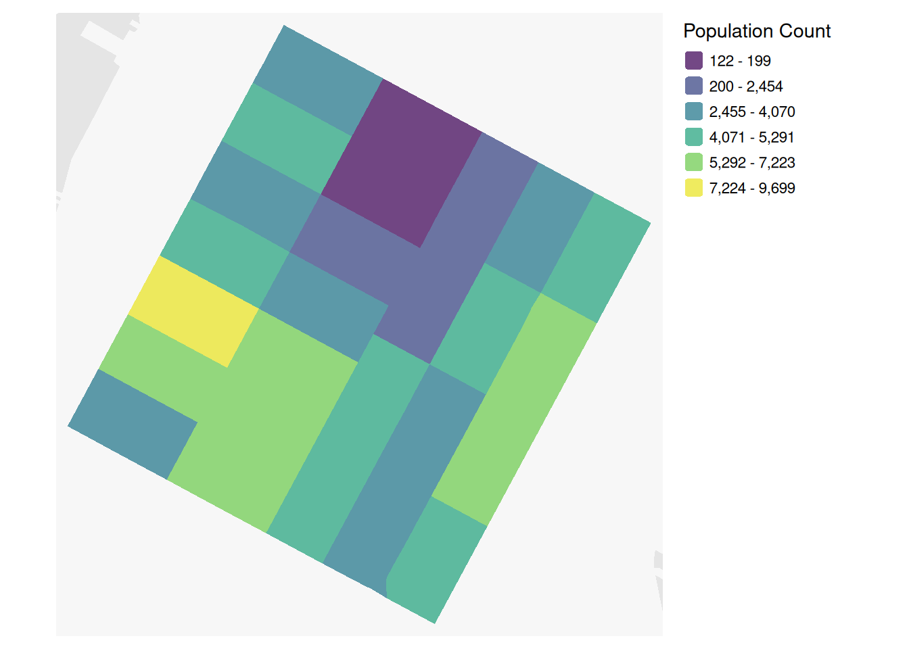
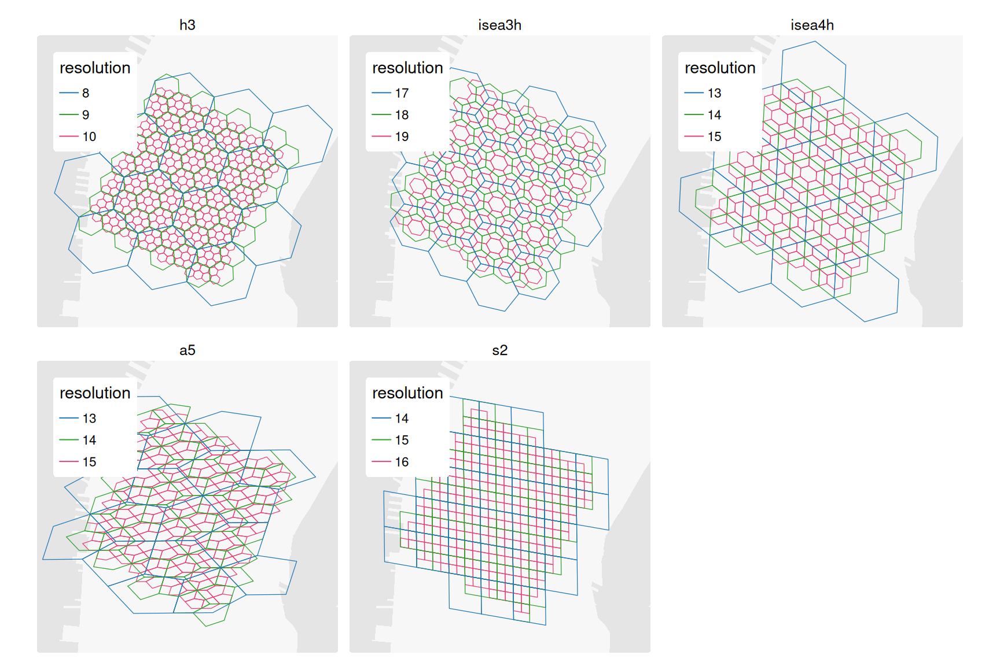
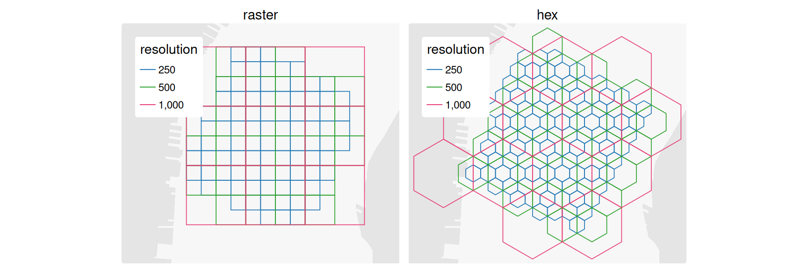
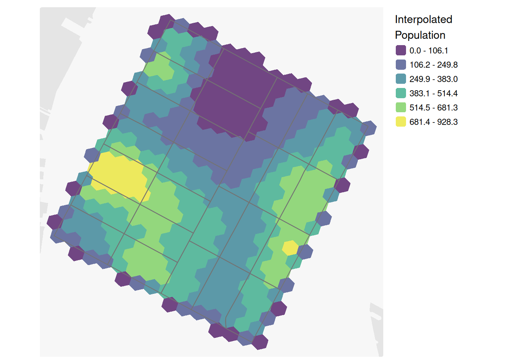
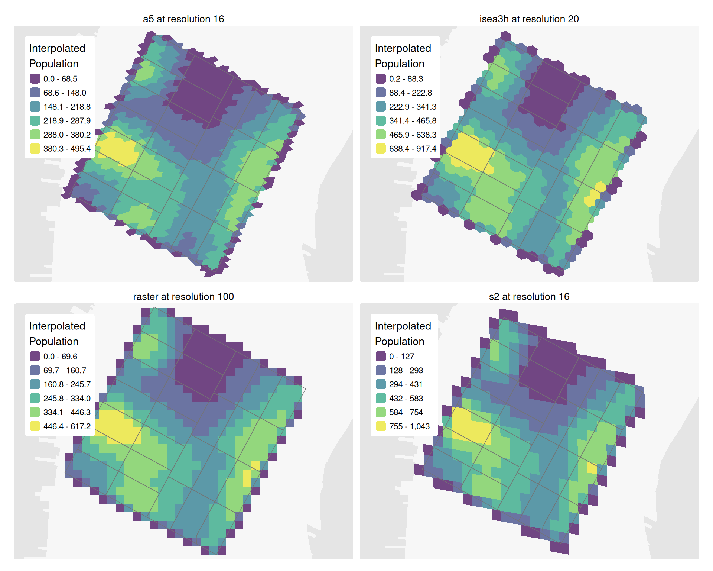
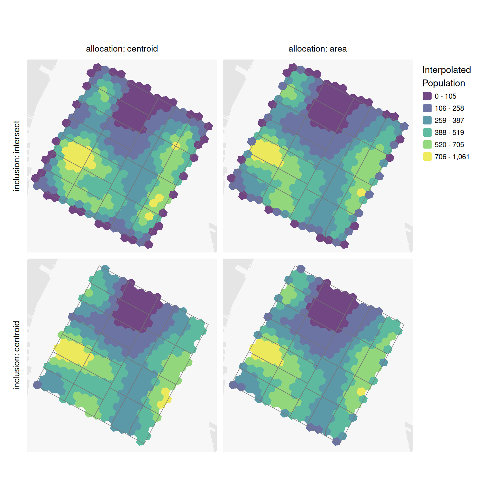
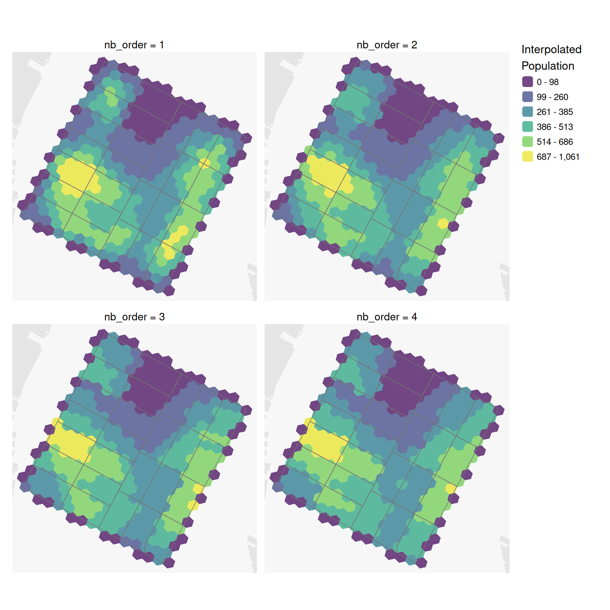

# `{pycnogrid}`: Flexible pycnophylactic interpolation to discrete global and local grid systems

## Introduction

Spatial data capturing the socioeconomic, demographic, environmental,
health, travel, and other characteristics of different places has become
increasingly abundant. However, much of these data are released in a
spatially aggregated form, represented through administrative and
statistical reporting units such as census tracts, postal codes, or
traffic analysis zones. While these spatial units facilitate data
collection, privacy protection, and dissemination, they may not align
with the geographic frame associated with particular research questions
or analyses. This mismatch lies at the heart of the modifiable areal
unit problem (MAUP) ([Openshaw 1979](#ref-openshaw1979)), which
recognizes that observed spatial patterns and statistical relationships
may vary according to the zoning system used to aggregate data. This
includes the scale effect, related to the size of geographic units, and
the zoning effect related to how the polygons are drawn. In response,
researchers and practitioners may look to methods for transferring or
interpolating information from source zones to more standardized target
geographies while preserving known source zone totals. At the same time,
the development of area or shape preserving hierarchical discrete global
grid systems (DGGSs) and alternative local grid options presents an
opportunity to extend traditional interpolation methods to accommodate
different grid types.

Among areal interpolation methods for extensive data, Tobler
([1979](#ref-tobler1979))’s pycnophylactic interpolation is
distinguished by its emphasis on mass or volume preservation and spatial
smoothing. Rather than assuming constant distributions of the source
zone values across the target cells, pycnophylactic interpolation
iteratively smooths the estimated target values while enforcing the
preservation of the source zone totals in the system. With sufficiently
fine target geometries, the result is a continuous spatial surface that
preserves known aggregate quantities while reducing the abrupt
discontinuities across zones introduced by administrative boundaries. In
doing so, the method acknowledges that spatial aggregation obscures
local variation and seeks to recover a *plausible* representation of the
spatial phenomena at a finer alternative level of geography. The
resulting surface embodies the intuition that nearby locations are
expected to exhibit greater similarity than more distant locations
([Tobler 1970](#ref-tobler1970); [Tobler 2004](#ref-tobler2004)).

Several implementations of Tobler’s pycnophylactic interpolation exist
for popular computing languages, including `{pycno}` ([Brunsdon
2025](#ref-pycno2025)) for R and within the `{tobler}` package ([Eli
Knaap et al. 2026](#ref-eliknaap2026)) for Python, which is part of the
larger Python Spatial Analysis Library (PySAL) ([Sergio Rey et al.
2026](#ref-sergiorey2026)). These existing implementations have largely
followed Tobler’s initial formulation of pycnophylactic interpolation
from source zones to target raster cells. For example, the `pycno()`
function from the `{pycno}` package converts source polygons to a
regular grid and initializes a density surface by assigning a uniform
density to all grid cells within each source zone. The density surface
is then iteratively smoothed across neighbouring grid cells while
correction steps ensure that the integrated target values within each
source polygon remain equal to their original observed total. Built on
the legacy [sp](https://github.com/edzer/sp/) framework, the package
requires `SpatialPolygonsDataFrame` inputs and outputs a
`SpatialGridDataFrame`. The PySAL `tobler` implementation follows a
similar raster-based philosophy but performs smoothing through
convolution-based operations on an array, with repeated correction steps
used to preserve source-zone totals in the target cells.

Building on these foundations, the primary contribution of
[pycnogrid](https://higgicd.github.io/pycnogrid/) is not a new
pycnophylactic algorithm for users of the R computing language, but
rather a more flexible implementation that extends pycnophylactic
interpolation beyond regular raster lattices to a range of DGGS spatial
grids. Capitalizing on the contemporary simple features
[sf](https://r-spatial.github.io/sf/) ([Pebesma 2018](#ref-pebesma2018))
library and the neighbour relationships and spatial weights matrices
that underpin much of modern spatial analysis and econometrics ([Anselin
1988](#ref-anselin1988)) (through the
[spdep](https://github.com/r-spatial/spdep/) ([Bivand
2022](#ref-bivand2022)) and [sfdep](https://sfdep.josiahparry.com)
([Parry and Locke 2024](#ref-sfdep2024)) packages),
[pycnogrid](https://higgicd.github.io/pycnogrid/) implements
pycnophylactic interpolation as a generalized neighbourhood-based
smoothing problem. Rather than restricting smoothing to a regular raster
lattice, values are smoothed using the neighbourhood structure defined
by the underlying grid, allowing the method to be applied consistently
across grid systems including H3, A5, S2, and various ISEA apertures, as
well as traditional rasters and other local grids. This flexibility
enables users to select a grid system whose geometric properties are
better aligned with the requirements of subsequent analyses.

## Example Workflow

The primary function in {pycnogrid} is
[`to_grid()`](https://higgicd.github.io/pycnogrid/reference/to_grid.md),
which takes the following parameters:

```` markdown
```{r}
#| label: to_grid
#| echo: true
pycnogrid::to_grid(
  source,
  value_col,
  id_col = NULL,
  grid_type = c("h3", "a5", "s2", "isea3h", "isea4h", "raster", "hex"),
  resolution,
  cell_inclusion = c("intersect", "centroid"),
  cell_allocation = c("centroid", "area"),
  nb_order = 1,
  max_iter = 500,
  tolerance = 1e-4,
  include_self = TRUE,
  missing_policy = c("abort", "warn", "ignore")
) 
```
````

where

- `source` is the source {sf} polygon layer containing the totals to be
  interpolated. Given the geometry calculations performed by the tool,
  only inputs with projected coordinate reference systems are accepted.
- `value_col` is the column in `source` containing the count variable to
  be smoothed and preserved
- `id_col` is an optional column uniquely identifying each source
  polygon, if omitted, an internal identifier is created
- `grid_type` specifies the target grid system. Supported options are
  H3, A5, S2, ISEA grids with aperture-3 and 4, and raster-derived
  polygon cells
- `resolution` controls the size of the target grid cells; its
  interpretation depends on the selected grid type
- `cell_inclusion` defines how candidate grid cells are selected for
  interpolation. With `"intersect"`, cells are included if they
  intersect a source polygon. With `"centroid"`, cells are included only
  when their centroid falls inside a source polygon.
- `cell_allocation` defines how source totals are allocated to grid
  cells. With `"centroid"`, each grid cell is assigned to the source
  polygon containing its centroid. With `"area"`, values are allocated
  in proportion to the area of overlap between source polygons and grid
  cells.

> **Fractional area allocation**
>
> As of version 0.2.1, `cell_allocation = "area"` is labelled
> experimental. It preserves the overall or global represented total but
> may not reproduce individual source-zone totals when cells cross
> source boundaries as some drift can occur due to the areal allocation
> of values and weights. Use centroid allocation when strict source-zone
> preservation is required.

- `nb_order` specifies the neighbourhood order used during smoothing. A
  value of 1 uses immediately adjacent cells, while larger values extend
  the smoothing neighbourhood outwards from a given cell.
- `max_iter` sets the maximum number of smoothing iterations. If set to
  0, the function returns the initial allocation without iterative
  smoothing.
- `tolerance` defines the convergence threshold. Iteration stops when
  the relative change in estimated cell densities falls below this
  value.
- `include_self` controls whether each cell includes its own current
  value when calculating the neighbourhood mean during smoothing.
- `missing_policy` determines how the function handles source polygons
  that receive no target grid cells, which might arise due to a mismatch
  in source polygon sizes and target grid cell resolutions. “abort”
  stops with an error, “warn” returns a warning, and “ignore” proceeds
  silently.

Together, these parameters define three main stages of the workflow:
construction of the target grid, allocation of source totals to grid
cells, and iterative pycnophylactic smoothing. The grid parameters
determine the spatial support of the output surface, the allocation
parameters determine the initial mass-preserving estimate, and the
smoothing parameters control how values are redistributed across
neighbouring cells. Centroid-based allocation preserves the original
source-zone totals with high accuracy while areal allocation preserves
global totals but can result in some drift in source values (see the
details below). Additional functions, such as
[`to_h3()`](https://higgicd.github.io/pycnogrid/reference/to_h3.md) and
[`to_a5()`](https://higgicd.github.io/pycnogrid/reference/to_a5.md), are
grid-specific wrappers around
[`to_grid()`](https://higgicd.github.io/pycnogrid/reference/to_grid.md).
The properties of the different grid systems are discussed further
below.

### Source Zone Data

The first part of a pycnophylactic workflow is to obtain more aggregate
source data to be smoothed to a finer-resolution target grid.
Pycnophylactic interpolation is designed for non-negative extensive
variables – quantities such as counts that can meaningfully be divided
among smaller areas and whose total should be preserved. Due to the area
and intersection calculations required for pycnophylactic smoothing, the
source zones must be provided to the tool in a projected coordinate
reference system. For an example case, 2020 population data was obtained
for census tracts in New York City using the {tidycensus} ([Walker and
Herman 2026](#ref-tidycensus2026)) package. A sub-sample of this data
covering an area of Lower Manhattan is included in the package as
`nyc_ct_small` ([Figure 1](#fig-sample_population_count)). The census
tracts in this area contain a total of 113,359 people.



Figure 1: Sample population count data for Lower Manhattan

### Target Grid Systems

The choice of a target grid system is not merely a computational
consideration as different grid systems prioritize different geometric
and analytical properties, including equal-area representation, shape
preservation, neighbourhood structure, hierarchical indexing, and
scalable spatial computation ([Table 1](#tbl-grids)).

| Grid System | Cell Geometry | Area Property | Extent and Hierarchy | Subdivision / Aperture | Neighbour Topology | Analytical Implication |
|----|----|----|----|----|----|----|
| H3 | Mostly hexagons, with twelve pentagons | Approximately equal-area | Global discrete grid with a nested hierarchy | Aperture-7 hierarchy with alternating cell orientation across resolutions | Usually six edge-neighbours; pentagons have five | Strong indexing and neighbourhood structure, particularly useful for mobility, accessibility, and spatial aggregation |
| ISEA3H, ISEA4H | Mostly hexagons, with twelve pentagons on an icosahedral projection | Equal-area | Global discrete grid with a nested hierarchy | Aperture-3 and Aperture-4 hierarchies, \#, and Aperture-7 hierarchies | Usually six edge-neighbours; pentagons have five | Equal-area hexagonal option with relatively fine-grained hierarchical scaling between resolutions |
| A5 | Equal-area pentagonal cells | Equal-area | Global discrete grid with a hierarchical structure | Five-way initial refinement, followed by four-way refinement | Predominantly five edge-neighbours | Provides a global equal-area alternative with strong indexing, although its pentagonal geometry may produce more directional variation than hexagonal grids |
| S2 | Quadrilateral cells projected from the faces of a cube | Not equal-area | Global discrete grid with a nested hierarchy | Quadtree subdivision: each cell has four children | Variable topology across cube-face boundaries | Strong global indexing and web-mapping infrastructure, but cell areas vary substantially across locations |
| Local Raster | Rectangular cells in a projected CRS | Equal-area only when constructed in an appropriate projected CRS | Usually regional or local; hierarchy is not intrinsic | Resolution specified directly in map units | Four- or eight-neighbour structure, depending on rook or queen contiguity | Simple and familiar benchmark, but geometric properties depend on the selected projection and resolution |
| Local Hex | Regular hexagonal cells in a projected CRS | Equal-area only when constructed in an appropriate projected CRS | Usually regional or local; hierarchy is not intrinsic | Resolution specified directly in map units | Usually six edge-neighbours in a complete tessellation | Local hexagonal support with six symmetric first-order neighbours, but geometric properties depend on the selected projection and resolution |

Table 1: Supported target grid systems and their principal geometric and
hierarchical properties

Sample discrete global grids generated at different resolution levels to
cover the census tracts for Lower Manhattan from
[Figure 1](#fig-sample_population_count) are shown in
[Figure 2](#fig-sample_dggs_grids). Among the DGGSs, the H3 grid system
is a global-scale spatial indexing system developed by Uber to support
routing and mobility analytics. It is a hierarchical hexagonal (mostly –
twelve pentagonal cells are required to accommodate the topology of a
spherical surface) DGGS built on an icosahedral projection of the Earth
with 16 resolution levels. H3 offers scalable hierarchical spatial
indexing as each cell at a given level of the hierarchy can be
sub-divided into a set of 7 child sells, although the cell tesselations
rotate slightly at each resolution level. Compared to raster cells, the
hexagonal tesselation also offers consistent neighbourhood relationships
and more isotropic traversal pathways between neighbouring cells with
approximately equal distances to all first-order neighbours. Because H3
is built on a gnomonic projection, hexagons tend to preserve their shape
in projected spatial analytical workflows. However, because of this
projection, H3 cells distort globally and are not equal area. While they
may be approximately equal at the urban scale, cells compared at the
global scale can differ in area quite significantly. Support for H3 in
[pycnogrid](https://higgicd.github.io/pycnogrid/) is offered through the
[h3o](https://github.com/extendr/h3o) ([Parry 2025](#ref-h3o2025))
package.

The Icosahedral Snyder Equal Area (ISEA) grid system partitions the
globe into equal area hexagons with 31 supported resolution levels.
Similar to H3, twelve pentagonal cells are required. In contrast to H3,
where cells are approximately equal area, ISEA grids prioritize
identical cell areas with more aligned nesting. This comes at the cost
of shape preservation, with ISEA hexagons appearing more elongated than
H3 when represented in conventional geographic or local projected
coordinate systems. The ISEA grid supports several different apertures,
including Aperture-3, 4, 7, and 4/3 mixed. At Aperture-3, parent cells
divide into 3 child cells, while at Aperture-7 the ISEA grid behaves
similar to H3 with each cell splitting into 7 across resolution levels.
Support for ISEA grids is currently limited to Aperture-3 and 4 and
offered through the [hexify](https://gillescolling.com/hexify/)
([Colling 2026](#ref-hexify2026)) package.

The A5 grid system is a recent DGGS that is explicitly designed to be
equal area across the globe. Based on pentagons and 31 different
resolution levels, A5 cells at a given resolution sub-divide into 5
child cells. The primary motivation behind A5 is spatial analysis as the
equal area properties of the grid system greatly simplify comparisons of
densities, rates, and other aggregated quantities over space. However,
the subdivision of parent into child cells is not regular with cell
shapes becoming more elongated at higher resolutions, meaning the
distance between cell centroids is not uniform. With these slightly
elongated pentagonal shapes, A5 cells are more anisotropic than H3
cells, although the extent to which impacts traversal pathways across
the equal area cell topology has not yet studied. Support for the A5
grid system is offered through the
[a5R](https://github.com/belian-earth/a5R) ([Graham 2026](#ref-a5R2026))
package.

S2 was developed by Google for global-scale spatial indexing and
geometric computation. S2 begins by projecting the Earth onto the flat
planes of a cube. Within a 31-level resolution hierarchy, each cell
sub-divides into 4 child cells. While use of H3 and A5 might be
motivated by neighbourhood regularity and equal-area representation,
respectively, S2 emphasizes hierarchical spatial indexing and efficient
spherical geometry operations. Consequently, the use of S2 within
{pycnogrid} may be attractive when interpolated data are intended for
integration with large-scale geospatial databases, distributed computing
environments, or workflows that already rely on S2 indexing. Support for
S2 in [pycnogrid](https://higgicd.github.io/pycnogrid/) is offered
through the [s2](https://r-spatial.github.io/s2/) ([Dunnington et al.
2025](#ref-s22025)) package.



Figure 2: Sample DGGS hierarchies at different resolutions

Of the supported local grid types in
[Figure 3](#fig-sample_local_grids), raster grids are the most familiar,
representing geographic space as a regular lattice of equally sized
cells. Their simplicity has made them the dominant representation for
continuous spatial phenomena and the traditional support for
pycnophylactic interpolation. However, raster grids are inherently
planar, which requires projection choices, and neighbourhood
relationships depend on user-specified contiguity definitions (e.g.,
rook or queen adjacency). In terms of indexing, raster cells are not
uniquely identified by a global index and any hierarchical relationships
among cells of different resolutions would have to be manually
specified. The neighbourhood structure is also anisotropic, with greater
distances required to traverse cells diagonally than horizontally or
vertically. Support for rasters in
[pycnogrid](https://higgicd.github.io/pycnogrid/) is offered through the
[terra](https://rspatial.org/) ([Hijmans et al. 2026](#ref-terra2026))
package.

Finally, users can also generate local regular hexagonal tessellations.
Unlike the global DGGS options, these grids are defined within the
coordinate reference system of the input data and have no intrinsic
global index or hierarchical structure. Their area and shape properties
therefore depend on selecting an appropriate projected CRS, while their
alignment and resolution are specified directly in the map units of that
CRS. Built on the {sf} ([Pebesma 2018](#ref-pebesma2018)) package, this
option provides a familiar local hexagonal support for analyses focused
on a particular region or study area.



Figure 3: Sample local grid hierarchies at different resolutions

### Pycnophylactic Interpolation

With source data collected, the pycnophylactic smoothing can now be run.
In this example case, an H3 grid at a resolution of 10 is used:

``` r

pycno_nyc_ct_small <- nyc_ct_small |>
  pycnogrid::to_grid(
    value_col = populationE,
    grid_type = "h3",
    resolution = 10,
    cell_allocation = "centroid"
  )
```

The results of this interpolation are shown in
[Figure 4](#fig-pycno_nyc_ct_small) below:



Figure 4: Census tract population counts interpolated to an H3 grid

The results for other grid types can be seen in
[Figure 5](#fig-pycno_nyc_ct_small_resolutions):



Figure 5: Census tract population counts interpolated to all four grid
types

The summary statistics of the population variable for the different grid
specifications is shown in [Table 2](#tbl-grid_descriptives). While the
different grid types and resolutions necessarily produce different mean
population values across the target cells, the total population spread
over the target cells is intact.

| grid type | grid resolution | grid cell count | mean cell population | total population |
|----|----|----|----|----|
| h3 | 10 | 336 | 337.3780 | 113359 |
| isea3h | 20 | 351 | 322.9601 | 113359 |
| isea4h | 16 | 427 | 265.4778 | 113359 |
| a5 | 16 | 635 | 178.5181 | 113359 |
| s2 | 16 | 312 | 363.3301 | 113359 |
| raster | 100 | 504 | 224.9187 | 113359 |
| hex | 100 | 574 | 197.4895 | 113359 |

Table 2: Population descriptive statistics for different grid types

The main customizations for
[`to_grid()`](https://higgicd.github.io/pycnogrid/reference/to_grid.md)
involve defining additional options to guide the pycnophylactic
interpolation. First, the cell inclusion and allocation criteria impact
how target cells are generated and how source values are allocated to
them.

- with `cell_inclusion = "intersect"` and
  `cell_allocation = "centroid"`, all intersecting grid cells remain in
  the target grid, but source values are assigned only to cells whose
  centroids fall within a source polygon. Target cells whose centroids
  fall outside the source polygons do not receive any initial allocation
  of the source values. Compared to area-based allocation, this simpler
  allocation method is more sensitive to the grid resolution and the
  placement of target cell centroids. Values associated with any source
  polygons that have no assigned target cells, such as small or narrow
  polygons, will be omitted from the system. When
  `missing_policy = "abort"`, this will cause the tool to abort. These
  are the default settings.

- with `cell_inclusion = "centroid"` and `cell_allocation = "centroid"`,
  target cells are both selected and assigned according to centroid
  location. Each retained cell is associated with the source polygon
  containing its centroid, producing the simplest and most discrete
  source-to-grid assignment with the strongest concentrations of source
  values within the target cells. However, as above, the centroid-based
  allocation approach is sensitive to grid resolution and alignment
  relative to the source polygons, risking truncated spatial support of
  the source layers within the target cell tessellation and the
  potential loss of source values if no cell centroids fall within the
  original polygon boundaries.

- with `cell_inclusion = "intersect"` and `cell_allocation = "area"`,
  all cells intersecting the source polygons are retained, and source
  totals are initially allocated according to the area of overlap
  between source polygons and target cells. This is the most
  geographically complete and resolution robust representation of the
  source layer as the data from all source-target intersections are
  retained. Partially covered edge cells receive only the share of the
  source value associated with their covered area. At present, the
  smoothing can result in some drift of source zone totals wherein the
  interpolated values do not match the original source zone totals for a
  given zone after re-aggregation, although the global source total is
  reproduced.

- with `cell_inclusion = "centroid"` and `cell_allocation = "area"`,
  only target cells whose centroids fall within the source layer are
  retained, but the retained cells receive source values according to
  their actual areas of overlap. While this avoids retaining cells that
  merely touch a source boundary, the resulting grid may not fully cover
  the source polygons, leading to a truncation in the spatial support
  offered by the target cells. The area-based allocation nevertheless
  helps to preserve source values in the system based on the areal
  overlap of source polygons and target cells. At present, the smoothing
  can result in some drift of source zone totals wherein the
  interpolated values do not match the original source zone totals for a
  given zone after re-aggregation, although the global source total is
  reproduced.

The smoothed results using the default and other cell inclusion and
allocation settings are shown in
[Figure 6](#fig-pycno_nyc_ct_small_combinations) below.



Figure 6: Interpolated population counts with varying inclusion and
allocation parameters

The second customization involves setting the number of neighbours
through the `nb_order` parameter. Here the default is `1`, which results
in the spatial weights matrix accounting for spatial relationships
between a given target cell and its first-order neighbours with Queen
contiguity. Increasing the order of the neighbourhood includes target
cells from a larger neighbourhood which this has the effect of further
smoothing out the spatial patterns of the interpolated values in the
target cells. This can be seen in
[Figure 7](#fig-pycno_nyc_ct_small_nb_order).



Figure 7: Interpolated population counts with increasing neighbourhood
order

## Conclusion

[pycnogrid](https://higgicd.github.io/pycnogrid/) provides a flexible
implementation of pycnophylactic interpolation for redistributing
polygon-based count data to discrete global and local grid systems. By
expressing smoothing through neighbourhoods and spatial weights, the
package extends the approach beyond regular raster lattices to H3, A5,
S2, and ISEA grids, as well as raster and local hexagonal grids.

The package makes explicit several analytical choices that are often
implicit in interpolation workflows. Users can control how target cells
are included, how source values are allocated, the neighbourhood order
used for smoothing, and whether cells contribute to their own
neighbourhood means. With the default centroid-based allocation, each
allocated target cell is assigned to one source zone, allowing the
correction step to preserve represented source-zone totals under a
discrete cell-ownership model. Fractional area allocation provides a
more geographically complete treatment of source–target intersections,
but it is experimental in version 0.2.1: it preserves the overall
represented total but may not reproduce each individual source-zone
total when target cells cross source boundaries.

The resulting surfaces should be understood as analytically useful,
plausible estimates rather than observations at a finer geographic
scale. Grid geometry, resolution, inclusion rules, allocation method,
and neighbourhood structure can all affect the resulting spatial
distribution and should be selected with reference to the intended
analysis. Moreover, by representing source values over target cells,
this grid-based method can extend or extrapolate source values beyond
the original source polygon boundaries, particularly when the allocation
method is based on cell centroids.

Future work could introduce an exact non-negative correction for
fractional area allocation, ancillary-data weighting (e.g. [Tapp
2010](#ref-tapp2010)), alternative smoothing operators, and support for
additional area- or shape-preserving grid systems. In its current form,
[pycnogrid](https://higgicd.github.io/pycnogrid/) provides a practical
framework for comparing smooth gridded representations across
alternative spatial support systems while making their allocation
assumptions and preservation guarantees explicit.

## References

Anselin, Luc. 1988. *Spatial Econometrics: Methods and Models*. Springer
Netherlands. <https://doi.org/10.1007/978-94-015-7799-1>.

Bivand, Roger. 2022. “R Packages for Analyzing Spatial Data: A
Comparative Case Study with Areal Data.” *Geographical Analysis* 54 (3):
488–518. <https://doi.org/10.1111/gean.12319>.

Brunsdon, Chris. 2025. *Pycno: Pycnophylactic Interpolation*.
<https://doi.org/10.32614/CRAN.package.pycno>.

Colling, Gilles. 2026. *Hexify: Equal-Area Hex Grids on the ’Snyder’
’ISEA’ ’Icosahedron’*. <https://doi.org/10.32614/CRAN.package.hexify>.

Dunnington, Dewey, Edzer Pebesma, and Ege Rubak. 2025. *S2: Spherical
Geometry Operators Using the S2 Geometry Library*.
<https://doi.org/10.32614/CRAN.package.s2>.

Eli Knaap, Renan Xavier Cortes, James Gaboardi, et al. 2026.
*Pysal/Tobler: V0.14.0*. April 10.
<https://doi.org/10.5281/ZENODO.3386576>.

Graham, Hugh. 2026. *a5R: ’A5’ Discrete Global Grid System*.
<https://doi.org/10.32614/CRAN.package.a5R>.

Hijmans, Robert J., Andrew Brown, and Márcia Barbosa. 2026. *Terra:
Spatial Data Analysis*. <https://doi.org/10.32614/CRAN.package.terra>.

Openshaw, Stan. 1979. “A Million or so Correlated Coefficients: Three
Experiment on the Modifiable Areal Unit Problem.” *Statistical
Applications in the Spatial Sciences*.

Parry, Josiah. 2025. *H3o: H3 Geospatial Indexing System*.
<https://doi.org/10.32614/CRAN.package.h3o>.

Parry, Josiah, and Dexter Locke. 2024. *Sfdep: Spatial Dependence for
Simple Features*. <https://doi.org/10.32614/CRAN.package.sfdep>.

Pebesma, Edzer. 2018. “Simple Features for r: Standardized Support for
Spatial Vector Data.” *The R Journal* 10 (1): 439.
<https://doi.org/10.32614/rj-2018-009>.

Sergio Rey, Philip Stephens, Taylor Oshan, et al. 2026. *Pysal/Pysal:
Release V26.01*. February 1. <https://doi.org/10.5281/ZENODO.2538852>.

Tapp, Anna F. 2010. “Areal Interpolation and Dasymetric Mapping Methods
Using Local Ancillary Data Sources.” *Cartography and Geographic
Information Science* 37 (3): 215–28.
<https://doi.org/10.1559/152304010792194976>.

Tobler, W. R. 1970. “A Computer Movie Simulating Urban Growth in the
Detroit Region.” *Economic Geography* 46 (June): 234.
<https://doi.org/10.2307/143141>.

Tobler, Waldo. 2004. “On the First Law of Geography: A Reply.” *Annals
of the Association of American Geographers* 94 (2): 304–10.
<https://doi.org/10.1111/j.1467-8306.2004.09402009.x>.

Tobler, Waldo R. 1979. “Smooth Pycnophylactic Interpolation for
Geographical Regions.” *Journal of the American Statistical Association*
74 (367): 519–30. <https://doi.org/10.1080/01621459.1979.10481647>.

Walker, Kyle, and Matt Herman. 2026. *Tidycensus: Load US Census
Boundary and Attribute Data as ’Tidyverse’ and ’Sf’-Ready Data Frames*.
<https://doi.org/10.32614/CRAN.package.tidycensus>.
